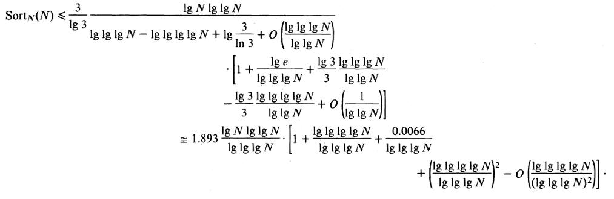

Minute Sort
===========

---

# What is Minute Sort?

- Simple task

- Sort as much as you can in ** 60 seconds **.

---

---

## What is Minute Sort?

- Current World Record - 1353 GiB in 60 seconds (*Triton Sort*, 2011)

- **22.5 GiB/s**

- Disk Read Speed: ~ 50 MiB/s 

---

# Architecture

---

## Architecture

- We will use Lonestar and Ranger

<table style = "font-size: 20px;" cellpadding ="5px">
<tr>
  <td>&nbsp;</td>
  <td>&nbsp;</td>
  <td><h3>Triton Sort</h3></td>
  <td>&nbsp;</td>
  <td><h3>Our Configuration</h3></td>
</tr>
<tr>
  <td><strong># of Nodes</strong></td> 
  <td>&nbsp;</td>
  <td align="right">52</td>
  <td>&nbsp;</td>
  <td align="right">4</td>
</tr>
<tr>
  <td><strong># of Cores / Node</strong></td> 
  <td>&nbsp;</td>
  <td align="right">2 Quadcores = 8</td>
  <td>&nbsp;</td>
  <td align="right">12</td>
</tr>
<tr>
  <td><strong>Total # of Cores</strong></td> 
  <td>&nbsp;</td>
  <td align="right">416</td>
  <td>&nbsp;</td>
  <td align="right">48</td>
</tr>
<tr>
  <td><strong>Disk Space</strong></td> 
  <td>&nbsp;</td>
  <td align="right">52 x 16 x 500 GiB &asymp; <strong>416 TiB</strong></td>
  <td>&nbsp;</td>
  <td align="right">250 GiB ($WORK)</td>
</tr>
<tr>
  <td><strong>Memory / Node</strong></td> 
  <td>&nbsp;</td>
  <td align="right">24 GiB</td>
  <td>&nbsp;</td>
  <td align="right">24 GiB</td>
</tr>
<tr>
  <td><strong>Total Memory</strong></td> 
  <td>&nbsp;</td>
  <td align="right"><strong>1248 GiB</strong></td>
  <td>&nbsp;</td>
  <td align="right">96 GiB</td>
</tr>
</table>

---

# Back of the Envelope Calculations

---

 
 
 
 
 

---

# Back of the Envelope Calculations

<h1 style="font-size:25px">Triton Sort</h1>

- 52 nodes, each have 16 disks

- A total of 832 disks

- A conservative esimate: 60 MB/s R/W speed => ~ **50 GiB/s** of bandwidth

---

# Back of the Envelope Calculations

<h1 style="font-size:25px">Triton Sort</h1>

- Their sorting speed => **22.5 GiB/s**

- = 22.5 GiB/s Reading + 22.5 GiB/s Writing 

- = 45 GiB/s 

- They are operating at close to disk bandwidth 

---

## Architecture

- Use **OpenMPI** for inter-machine parallelism

- Use **Cilk** for intra-machine parallelism

---

# Basic Algorithm

---

## Basic Algorithm - Inter Machine

- As discussed in class, we use over-sampling
to choose *k* good pivots, and hence divide the 
input into *k* roughly equal parts.

- Each machine then works on an independent 
partition.

- When all the machines have independently sorted
their partition, we can stitch the independent
paritions without needing to merge them.

---

## Basic Algorithm - Intra Machine

- Use a Merge-Sort based algorithm
to sort the relevant parition on each node.

- Use Cilk for this purpose

- Try various optimizations to reduce buffer copying in Merge-Sort.

---

# Challenges

---

## Challenges

- We are practically limited by the disk I/O
bandwidth. If the disk can only read / write
50 MB/s, we cannot sort more than (50*60)/2 = 1.5 GB
in a minute. Potentially use compression before
writing.

- Network Bandwidth might be limited. Potentially use
compression.

- Certain optimizations like ensuring the file is in
the cache might help (by reading the file just before
the program is run).

---

# Thank You

